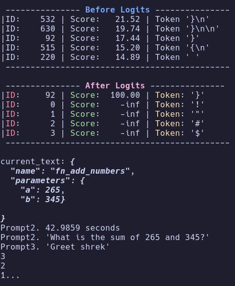
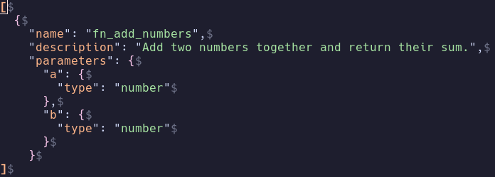
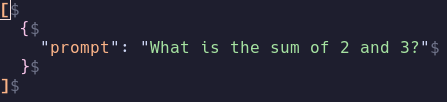
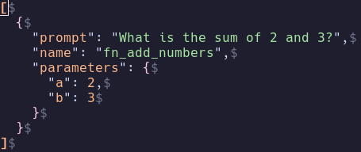

*This project has been created as part of the 42 curriculum by nsato.*

<table>
	<thead>
    	<tr>
      		<th style="text-align:center"><a href="README.md">English</a></th>
      		<th style="text-align:center">日本語</th>
    	</tr>
  	</thead>
</table>

<h1>
	Call_Me_Maybe
</h1> <H2>
 LLMにおける関数呼び出し(Function Calling)の概要
</H2>



## 📖*Content*
---
1. [💡概要](#1.概要)
2. [✅手順](#2.手順)
3. [⛏追加要件](#3.追加要件)
	1. [アルゴリズムの説明](#3-1.アルゴリズムの説明)
	2. [設計上の決定事項](#3-2.設計上の決定事項)
	3. [性能分析](#3-3.性能分析)
	4. [直面した課題](#3-4.直面した課題)
	5. [テスト戦略](#3-5.テスト戦略)
	6. [使用例](#3-6.使用例)
4. [🌈リソース](#4.リソース)
	1. [AIの使用について](#4-1.AIの使用について)

## 1.概要
---
このプロジェクトでは、自然言語のプロンプトを型付き引数を持つ構造化された関数呼び出しに変換するシステムを構築することで、大規模言語モデルにおける関数呼び出しの仕組みを紹介します。  
有効なJSON出力を保証するための制約付きデコードを実装し、わずか0.5Bパラメータのモデルでほぼ完璧な信頼性を実現することで、人間の言語とコンピュータが実行可能な操作との間のギャップを埋めます。(プロジェクトページより)  

## 2.手順
---
- もしuvがインストールされていない場合、uvの公式インストーラスクリプトを実行してください。  
```
curl -LsSf https://astral.sh/uv/install.sh | sh
```
 `make run`で実行可能だが、プロジェクトPDFに厳密に従うのであれば下記の手順を順番に実行してください。  
*Makefile使用時はデフォルトのファイルのみ指定可能です。*  
  
1. 仮想環境の構築から開始。  
```
make setup
```
2. uvによる仮想環境の構築と必須パッケージのインストール。
```
make install
```
3. **必須ファイルのインストール**  
```
make llm
```
4. PDFの仕様に基づき、下記コマンドをターミナルで実行しシステムを起動。  
```
uv run python -m src [--functions_definition <function_definition_file>] [--input <input_file>] [--output <output_file>]
```
- このコマンドは、デフォルトでdata/input/ディレクトリから入力ファイルを読み取り、data/output/ディレクトリに結果を書き出します。  
- 最終的な出力は`data/output/function_calling_results.json`という単一のJSONファイルです。  
- 入力された各自然言語プロンプトに対し、以下のキーを厳密に持つJSONオブジェクトの配列を生成します。  
```
prompt (string): 元の自然言語リクエスト
name (string): 呼び出すべき関数名
parameters (object): スキーマ（型）に完全に準拠した引数データ
```
5. 単体テストの実行。
```
make test
```
6. コードのスタイルチェックとフォーマット。
```
make lint
```
または
```
make lint-strict
```
## 3.追加要件
---
### 3-1.アルゴリズムの説明
- どのようにして有効なJSON出力を保証するか  
	有限状態オートマトン(FSM:Finite State Machine）を使用して生成されるトークンを1つづつ解析し、「文字列の内部か」「キーか値か」「どのネストの深さか」などを判別します。  
	その文脈に基づいてJSONや期待する出力に違反するトークンを検出、違反するトークンの確率をマイナス無限大に設定し、モデルが正しいJSON出力を生成するように強制します。  

### 3-2.設計上の決定事項
- 実装における重要な選択について  
	FSMによる構造管理、強制キューを導入し、JSON構造化をLLMの推論に依存しない設計としました。  
	また、`twenty-five -> 25`のような数値の変換はLLMの推論能力を活かすため、プロンプトとの完全一致などはさせませんでした。  
	ただし、不要な0の連続や無限ループ防止のために各項目に文字数制限などでストッパーを設けました。  

### 3-3.性能分析
- ソリューションの精度、速度、信頼性について  
	0.5Bパラメータの軽量モデルですが、エッジケースでもほぼ100%の精度でJSON出力を生成します。  
	また、LLMの推論をパラメーター内部に絞り、必須構文に関する箇所を強制キューで管理することで、LLMの推論能力を最大限に活用しています。  

### 3-4.直面した課題
- 課題で指定されたtypeがintやfloatではなくnumberだったため、要求される出力形式が不明確で対応ができなかったです。
- JSON構造化を強制キューによる管理に変更するにあたり、それはハードコーディングに当たらないかと悩みましたがそもそも指定された事項である"name"や"parameters"、"type"などの事項は必須で取得しなければならず、今回大事なのは制約付きでコーディングの理解とLLMの推論能力を最大限に活用することだと判断し導入しました。  

### 3-5.テスト戦略
- 実装をどのように検証したか  
	通常ケースとエッジケース(空文字、特殊文字や長大な数字、nullやbooleanの対応)に分割し、それぞれに対してテストを実施しました。　　

### 3-6.使用例
`make run`  
または  
`uv run python3 -m src -f <関数ファイルパス> -i <プロンプトファイルパス> -o <出力ファイル>`  
で指定したファイルで実行します。  


- 関数定義は下記のように指定します。  

  

- 同じく、プロンプトは下記のようにして指定します。    

  

- 出力ファイル例  



## 4.リソース
---

- [組み込み例外](https://docs.python.org/ja/3.14/library/exceptions.html)
- [Pythonのraiseについて](https://zenn.dev/tektek/articles/9b8fd47e2cac4f)
- [Function Callingとは？仕組みや使い方をわかりやすく解説](https://aismiley.co.jp/ai_news/what-is-function-calling/)
- [生成AIアプリをより多機能に(Function Calling)](https://qiita.com/ksonoda/items/1ba3916c9ee9f4d9c10c)
- [ArgumentParserの使い方](https://qiita.com/kzkadc/items/e4fc7bc9c003de1eb6d0)


### 4-1.AIの使用について
---
- 42のプロジェクトページより世界のレビュー履歴300件の取得スクリプトの作成相談。  
->それを元にしたGemini CLIによるマークダウンファイルの作成。  
- 制約付きデコードにおける出力形式を課題に合わせるかどうか、解決策の壁打ち。  
- エッジケースの案出し。  
- コードリファクタリングの相談。　　
- README.md作成における自分が行った内容のまとめ。
- 英語版README.md作成時の翻訳(DeepL翻訳)